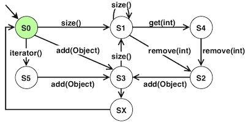

# Generate behavioral models for seeding with Botsing

The goal of behavioral model seeding (denoted model seeding hereafter) is to abstract the behavior of the software under test using models and use that abstraction during the search. At the unit test level, each model is a transition system, like in the following Figure:



 A model represents possible usages of a class (a `List` in this case): i.e., the possible sequences of method calls observed for objects of that class. For instance, the transition system model in the  Figure above has been partially generated from the following call sequences:
```
<size(), remove(), add(Object), size(), size(), size(), get(), remove(), add(Object)>
<iterator(),add(Object)>
...
```
Each transition (each arrow in the Figure) corresponds to a method call in one of the sequences, and for each sequence, there exists a path in the model.
From the model we can derive usages of the `List` and use those during the unit test generation process each time a `List` is required during the creation of a test case.

The main steps of our model seeding approach are:
- the inference of the individual models from the call sequences collected through static analysis performed on the application code, and dynamic analysis of the test cases; and
- for each model, the selection of usages using the test case generation process.

For more details on model seeding, please see the [STAMP Deliverable D3.3 - Prototype of amplification tool for common and anomaly behaviors](https://github.com/STAMP-project/docs-forum/blob/master/docs/d33_prototype_of_amplification_tool_for_common_and_anomaly_behaviors.pdf).

## Command line interface

Behavioral models represent the usages of the different objects involved in the project. To learn (i.e., generate) behavioral models for an application, one can use `botsing-model-generation` that (i) statically analyses the source code of the project and (ii) executes the test cases to capture usages of the objects.

The latest version of Botsing model generation in command line (botsing-model-generation-X-X-X.jar) is available at [https://github.com/STAMP-project/botsing/releases](https://github.com/STAMP-project/botsing/releases).

```Bash
java -d64 -Xmx10000m -jar bin/botsing-model-generation-X.X.X.jar \
	-project_cp $CLASSPATH \
	-project_prefix "my.package" \
	-out_dir "results/authzforce-core"
```
Where
- `-project_cp $CLASSPATH` provides the class path;
- `-project_prefix "my.package"` tells Botsing to run the test cases that are in the package `my.package` or one of its sub-packages; and
- `-out_dir "results/"` specifies the output directory for the models (models are generated in `results/models`).

Since model generation can consume a lot of memory, we strongly recommend to use the options ` -d64 -Xmx10000m` when executing the tool.
